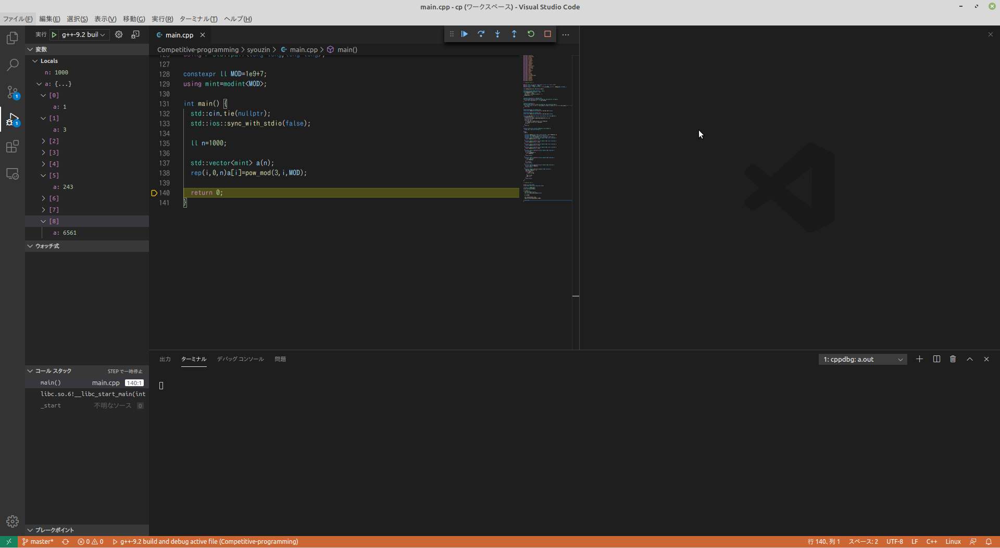

なんか環境構築で詰まったところとかがあり、情報もあまりなかったのでここにまとめておきます
試行錯誤してなんとか...という感じなので、**上手いやり方である**という保証はないです
なんか間違いがあったら教えてください

## 自分の環境
- Linux Mint 19.3 Tricia 64 ビット
- GCC 9.2.0
- gdb 8.1.0

## デバッグで出来ると嬉しいこと

競プロ範囲に限れば
- ステップ実行できる
- 変数の中身が見れる
- STLコンテナの中身も見やすい形で表示される
- 値とかは10進数で表示してほしい
- (実行中の値の変更)

このくらいかな

## 環境を作ってみる
gdbが入ってる状態でVSCode上でコマンドパレットを開き、"C/C++: build and debug active file"->"gdb"というのを選べば
おそらくそのとき開いてるワークスペースフォルダにlaunch.json,task.jsonが生成されて設定が出来るはず

この時点でmain関数とかにブレークポイントをおいてF5を押せば、普通に動くはず
なにかエラーが出たらエラー読んでlaunch.jsonの"miDebuggerPath"にgdbへのパスを指定したり、task.jsonでのコンパイルコマンドを確認する

## STLが...

STLコンテナ(vector,map,set...)もちゃんと中身の値見れるよ、という人はここ飛ばしても大丈夫です

↑の設定のままF5を押すとデバッグモードになりステップ実行や変数の確認などは出来るが、STLコンテナの中身は見れない
-enable-pretty-printingはsetupCommandで渡されているはずだが上手くいっていないらしい  


[ここ](https://gcc.gnu.org/onlinedocs/libstdc++/manual/debug.html) の"Using gdb"を見ると
新しいGCCにはちゃんとコンテナ用のprinterが同梱されているようなので探す

自分の場合は/usr/local/ にgcc9.2.0をインスコしたので
/usr/local/gcc-9.2/share/gcc-9.2.0/python 以下にお目当てのlibstdcxx/があった　この中にはprinter.pyがきちんと存在している
確かにコードをみるといろんなコンテナのPrinterが入っている

おそらくこのprinter.pyを上手く参照できていないのがダメっぽいですね

そこで[ここ](http://sourceware.org/gdb/wiki/STLSupport)の設定をまねして
~/.gdbinit(またはプロジェクトルートに個別に/.gdbinitを作る)に
```
python
import sys
sys.path.insert(0, '(↑に書いたgcc-hoge/pythonまでのパス)')
from libstdcxx.v6.printers import register_libstdcxx_printers
register_libstdcxx_printers (None)
end
```
この設定を追加して保存
ここまでやるとおそらくVSCodeからデバッグをしてもvector,setなどの中身が見えるようになってるはず

## VSCodeのウォッチ式でのフォーマット効かないんだけど

STLコンテナ見れるようにはなりました。しかし値が全部16進数になっていて競プロをやるには不便です。
調べるとウォッチ式で(変数名),d として表示フォーマットを10進数に変えればいけるそうです

<br>
<br>
<br>
は？効かないけど？
<br>
<br>
<br>
<br>

しょうがないのでgdb側でなんとかします
gdbのoutput-radixという環境変数で値を表示する際の基数を管理しているので
launch.jsonの"setupCommands"に
```
{    
  "text":"set output-radix 10"
}
```
を追加すればVSCode上の変数の値も10進数で表示されます

## 完成！




構造体のメンバ変数も表示するのでnoshi君のmodintとかも見やすく表示されます

## その他

Macとかだとどうするのがいいんでしょうか
gdb入れるのは少しめんどくさそうだったので
素直にlldbを使ったほうが良さそう
lldbの方でも上手く設定さえすれば同じようなことできそう
ただMacを持ってないし、自分の環境でlldb入れる気もないので実際に出来るかどうかは不明...